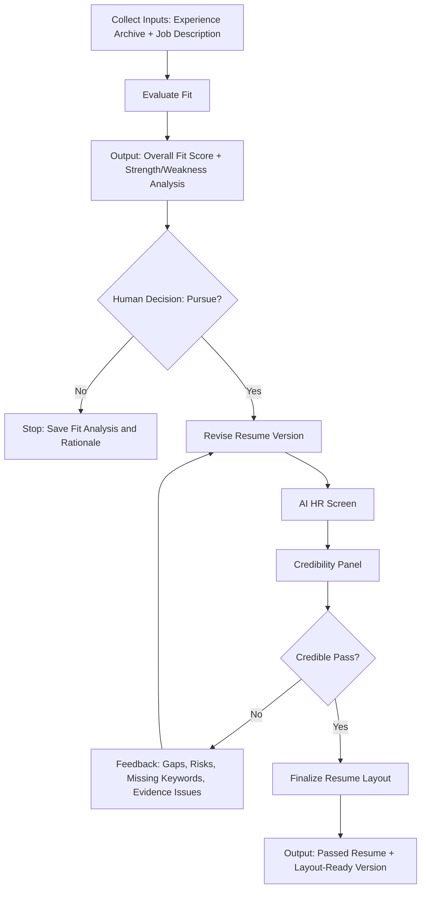

# Job Application Fit and Resume Revision Workflow

## Purpose

Evaluate whether a target position is worth pursuing, then iteratively revise the resume against the job description until an AI HR screen passes it, and finally prepare the resume layout.

## Required Inputs

- Full experience archive: master resume, project archive, achievement notes, portfolio links, publications, metrics, performance reviews, or any career history source.
- Target job description: role title, company, responsibilities, requirements, preferred qualifications, keywords, location, seniority, compensation if available.
- Constraints: truthful-only resume policy, target resume length, preferred tone, industries to emphasize or avoid, must-keep items, must-remove items.

## Workflow Overview



## Stage 1: Fit Evaluation

### Goal

Assess your fit for a specific position using the full experience archive, not only the current resume.

### Process

1. Extract role requirements from the job description.
2. Group requirements into:
   - Core responsibilities
   - Required qualifications
   - Preferred qualifications
   - Domain knowledge
   - Tools and technologies
   - Leadership, communication, or collaboration expectations
3. Extract matching evidence from the full experience archive.
4. Score each requirement by evidence strength.
5. Identify strengths, weaknesses, gaps, risks, and positioning angles.

### Scoring Rubric

Use a 100-point fit score:

| Category | Weight | What To Evaluate |
|---|---:|---|
| Core responsibility match | 30 | Have you done the main work of the role before? |
| Required qualification match | 25 | Do you meet explicit must-have requirements? |
| Evidence quality | 15 | Are achievements specific, recent, quantified, and credible? |
| Domain or industry relevance | 10 | Is your background close to the company or role context? |
| Tool, platform, or method match | 10 | Do you have the named technical or operational skills? |
| Seniority and scope match | 10 | Does your level of ownership match the role? |

### Score Interpretation

| Score | Recommendation |
|---:|---|
| 85-100 | Strong fit. Pursue unless there is a personal or logistical blocker. |
| 70-84 | Viable fit. Pursue if the role is strategically attractive. Resume tailoring is important. |
| 55-69 | Stretch fit. Pursue only if the company, role, or learning upside is high. |
| Below 55 | Weak fit. Usually do not pursue unless there is a referral or special reason. |

### Output Template

```text
Role:
Company:
Overall Fit Score: __ / 100
Recommendation: Strong pursue / Conditional pursue / Stretch / Do not pursue

Top Strengths:
1.
2.
3.

Main Weaknesses:
1.
2.
3.

Best Evidence From Experience Archive:
- Requirement:
  Evidence:
  Strength: High / Medium / Low

Missing Or Weak Evidence:
- Requirement:
  Gap:
  Mitigation:

Positioning Strategy:

Risks For Recruiter Screen:

Questions Before Applying:
```

## Stage 2: Human Pursue Decision

### Goal

Make a clear human decision before spending time revising the resume.

### Decision Output

```text
Pursue? Y/N
Reason:
Personal constraints:
Strategic value:
```

### Suggested Decision Rule

Choose `Y` if at least one is true:

- Fit score is 70 or above.
- Fit score is 55-69 and the role is strategically valuable.
- You have a strong referral or unusually relevant hidden evidence.
- The gap is mostly presentation, not actual experience.

Choose `N` if:

- Required qualifications are materially missing.
- The role does not support your career direction.
- The likely resume revision would exaggerate or distort your experience.

## Stage 3: Resume Revision

### Goal

Create targeted resume versions that truthfully maximize match to the job description.

### Inputs

- Fit evaluation from Stage 1
- Human decision from Stage 2
- Full experience archive
- Current resume if available
- Job description

### Revision Rules

- Do not invent experience, employers, dates, credentials, tools, metrics, or scope.
- Prefer evidence from the full archive over generic claims.
- Lead with the most relevant achievements.
- Mirror job description language where truthful.
- Quantify outcomes when the archive supports it.
- Convert weak matches into transferable framing instead of pretending they are direct matches.
- Remove or compress less relevant material to make room for role-relevant proof.

### Resume Version Strategy

Create up to three versions per cycle:

| Version | Purpose |
|---|---|
| Version A: Direct Match | Optimized for required qualifications and recruiter keyword matching. |
| Version B: Achievement Led | Optimized for business impact, metrics, and seniority signal. |
| Version C: Transferable Fit | Optimized for stretch roles where adjacent experience needs careful framing. |

### Output Template

```text
Resume Version:
Target Role:
Revision Strategy:

Professional Summary:

Core Skills:

Experience:

Selected Projects:

Education / Certifications:

Notes:
- Added:
- Removed:
- Reframed:
- Risks:
```

## Stage 4: Virtual AI HR Screen

### Goal

Simulate an initial recruiter or ATS-like screen for each resume version.

### Screening Criteria

| Category | Pass Standard |
|---|---|
| Must-have requirements | Clear evidence for most required qualifications. |
| Role keywords | Important terms are present naturally and truthfully. |
| Seniority signal | Scope, ownership, and outcomes fit the target level. |
| Clarity | Recruiter can understand fit within 30-60 seconds. |
| Credibility | Claims are specific, plausible, and supported by experience. |
| Risk | No obvious mismatch, unexplained gap, or overclaiming. |

### AI HR Output Template

```text
Resume Version:
Screen Result: Pass / Fail
Confidence: High / Medium / Low

Likely Recruiter Reaction:

Reasons For Pass/Fail:
1.
2.
3.

Missing Keywords Or Evidence:
- 

Weak Bullets:
- Current:
  Problem:
  Suggested Direction:

Overclaiming Or Credibility Risks:
-

Next Revision Instructions:
1.
2.
3.
```

## Stage 4B: Credibility Panel

### Goal

Strengthen the credibility of the virtual AI HR screen by using multiple reviewer perspectives, evidence-based scoring, and a red-team check. Treat this stage as a calibration layer: a resume should not be considered truly passed until the panel gives a `Pass` or a defensible `Borderline Pass` with clear mitigation.

### Reviewer Panel

Run five independent reviewer perspectives:

| Reviewer | What They Evaluate |
|---|---|
| ATS Screener | Keyword match, must-have requirements, section clarity, and parse-friendly wording. |
| HR Recruiter | 30-60 second screenability, role relevance, credibility, and interview-worthiness. |
| Hiring Manager | Whether the resume shows the person can actually do the job. |
| Red-Team Skeptic | Overclaiming, weak evidence, suspicious metrics, missing must-haves, and interview traps. |
| JD Evidence Auditor | Exact mapping between job description requirements and resume evidence. |

### Scoring Rubric

Use a 100-point panel score. Adjust categories to the role if needed, but keep the total at 100.

| Category | Weight | What To Evaluate |
|---|---:|---|
| Must-have requirement evidence | 25 | Does the resume clearly prove the required qualifications? |
| Core responsibility match | 20 | Does the resume show experience doing the main job? |
| Keyword and ATS alignment | 15 | Are important JD terms present naturally and truthfully? |
| Evidence strength and credibility | 15 | Are claims specific, supported, recent, and defensible? |
| Hiring-manager confidence | 15 | Would the hiring manager believe this person can execute? |
| Risk control | 10 | Are overclaims, gaps, and interview traps minimized? |

### Pass Standard

| Result | Standard |
|---|---|
| Pass | Average score 80+ and no unresolved red-team blocker. |
| Borderline | Average score 70-79 or one meaningful risk that can be mitigated. |
| Fail | Average score below 70 or any serious unsupported must-have claim. |

### Credibility Panel Output Template

```text
Resume Version:
Panel Result: Pass / Borderline / Fail
Average Score: __ / 100
Reviewer Agreement: High / Medium / Low

Reviewer Scores:
- ATS Screener: __ / 100
- HR Recruiter: __ / 100
- Hiring Manager: __ / 100
- Red-Team Skeptic: __ / 100
- JD Evidence Auditor: __ / 100

Reviewer Disagreement:
-

Top 3 Risks:
1.
2.
3.

Claims To Soften:
-

Claims To Strengthen:
-

Interview Traps:
-

Evidence Map:
- JD Requirement:
  Resume Evidence:
  Evidence Strength: High / Medium / Low
  Risk:

Final Decision:
Pass / Revise / Stop

Next Revision Instructions:
1.
2.
3.
```

## Stage 5: Revision Loop

### Goal

Repeat resume revision, AI HR screening, and credibility-panel review until one version receives a credible pass.

### Loop Rules

1. Screen every resume version with the virtual AI HR screen.
2. Run the credibility panel for every version that receives `Pass` or looks promising.
3. Select the strongest failed or borderline version as the base for the next revision.
4. Apply only feedback that is truthful and supported by the experience archive.
5. Stop when a version receives credibility-panel `Pass`.
6. If the best version is `Borderline`, ask the human whether to proceed, revise once more, seek a referral, or abandon.
7. If no version passes after three cycles, return to the human decision gate and decide whether to continue, seek a referral, or abandon the application.

### Loop Log Template

```text
Cycle:
Versions screened:
Best version:
AI HR pass achieved? Y/N
Credibility panel result: Pass / Borderline / Fail
Average panel score:

Most important changes this cycle:
1.
2.
3.

Remaining risks:
1.
2.

Next action:
```

## Stage 6: Layout

### Goal

Turn the passed resume into a clean, readable, application-ready layout.

### Layout Rules

- Keep the format simple and ATS-friendly.
- Use one column unless a human-facing designed version is specifically needed.
- Prioritize readability over decoration.
- Keep section headings conventional: Summary, Skills, Experience, Projects, Education.
- Use consistent dates, title formatting, bullet style, and spacing.
- Avoid text boxes, icons, graphics, tables, or unusual columns in the ATS version.
- Save a human-readable version separately only if useful.

### Layout Output

```text
Final Resume Version:
Layout Type: ATS / Human-readable / Both
File Outputs:
- Resume:
- Plain text resume:
- Notes:

Final QA:
- No invented claims.
- JD-critical keywords included.
- Strongest evidence appears on page 1.
- Dates and titles consistent.
- Contact details correct.
- No spelling or grammar issues.
```

## Master Prompt For Running The Workflow

```text
You are helping me evaluate and tailor my resume for a specific job.

Inputs:
1. Full experience archive:
[PASTE OR ATTACH]

2. Current resume:
[PASTE OR ATTACH]

3. Job description:
[PASTE]

4. Constraints:
[TRUTHFUL ONLY / LENGTH / TONE / LOCATION / OTHER]

Run this workflow:
1. Evaluate my strength and weakness according to the full experience archive for this position.
2. Output an overall fit score out of 100 and a detailed analysis.
3. Ask me for a human decision: pursue Y/N.
4. If I answer Y, revise my resume into multiple targeted versions.
5. Act as a virtual AI HR screener for each version and give pass/fail feedback.
6. Run a credibility panel with ATS, HR recruiter, hiring manager, red-team skeptic, and JD evidence auditor perspectives.
7. Repeat revision, screening, and credibility review until one version receives a credible pass, or until three cycles fail.
8. Once a version passes the credibility panel, produce an ATS-friendly final layout.

Rules:
- Do not invent facts.
- Use only evidence from my archive and current resume.
- If evidence is missing, mark it as a gap.
- Prefer specific achievements and measurable outcomes.
- Preserve credibility over keyword stuffing.
```

## Compact Operating Checklist

```text
[ ] Inputs collected
[ ] JD parsed
[ ] Experience archive mapped
[ ] Fit score produced
[ ] Strengths and weaknesses analyzed
[ ] Human decision recorded: Y/N
[ ] Resume versions drafted
[ ] AI HR screen completed
[ ] Credibility panel completed
[ ] Failed versions revised
[ ] Credible passing version selected
[ ] Final layout prepared
[ ] Final QA completed
```
